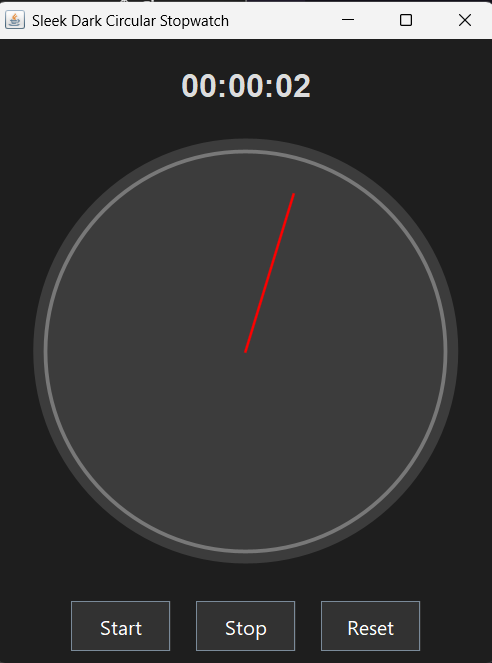

# ⏱️ SleekCircularStopwatch

A visually appealing dark-themed circular stopwatch built using Java Swing.  
Includes a modern UI with Start, Stop, and Reset functionalities, and a live updating second-hand animation.

---

## 🛠 Features

- ⭕ Animated circular stopwatch hand
- ⏳ Elapsed time display in `hh:mm:ss` format
- 🎨 Dark modern UI with custom fonts and button styles
- 🔁 Real-time updates using `javax.swing.Timer`

---

## 💻 Requirements

- Java JDK 8 or later
- Any Java IDE (e.g., VS Code, IntelliJ, Eclipse)
- VS Code Extensions (Recommended):
  - [Extension Pack for Java](https://marketplace.visualstudio.com/items?itemName=vscjava.vscode-java-pack)

---

## 🚀 Getting Started

### 1. Clone or Download the Repository

git clone https://github.com/Sanmitha-4/SleekCircularStopwatch.git
cd SleekCircularStopwatch

2. Run the Application

Using Terminal:
javac SleekCircularStopwatch.java
java SleekCircularStopwatch

Using VS Code:
1.Open SleekCircularStopwatch.java
2.Right-click anywhere in the file
3.Select Run Java

---

## 📁 Project Structure

.
└── SleekCircularStopwatch.java   # Main GUI stopwatch source file
└── README.md                     # This documentation

---

##🖼️ UI Preview

---
🔧 Customization Ideas

1.Add Lap feature with a list display
2.Sound alert on completion or intervals
3.Export elapsed time to a log file
4.Dark/light theme toggle
---
📜 License
This project is licensed under the MIT License.
Feel free to use, modify, and share!

---

🙋‍♀️ Author
Sanmitha S. Shetty

